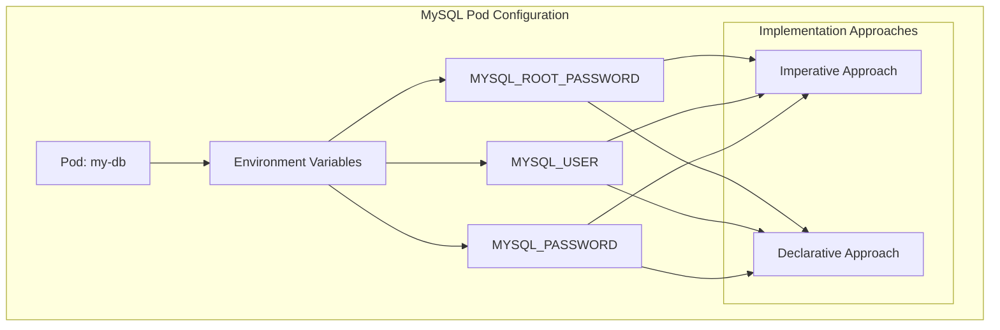

# 🌉 Kubernetes MySQL Environment Configuration Manager

[](https://github.com/TheToriqul/k8s-mysql-env-config)
[](https://github.com/TheToriqul/k8s-mysql-env-config/stargazers)


## 📋 Project Overview

This project demonstrates advanced environment variable management in Kubernetes, specifically focusing on MySQL database configuration. Through hands-on implementation, I explore both imperative and declarative approaches to managing environment variables in Kubernetes pods. The project showcases secure and efficient methods for configuring MySQL instances in containerized environments.

## 🎯 Key Objectives

- Implement MySQL database configuration using Kubernetes environment variables
- Demonstrate mastery of both imperative and declarative configuration approaches
- Showcase secure credential management practices
- Establish reproducible database environment setups
- Create comprehensive configuration documentation

## 🏗️ Project Architecture



## 💻 Technical Stack

- Frontend: N/A
- Backend:
  - Kubernetes for container orchestration
  - MySQL latest image
- Database:
  - MySQL with environment-based configuration
- DevOps:
  - kubectl CLI
  - YAML manifests
  - Docker runtime

## 🚀 Getting Started

<details>
<summary>🐳 Prerequisites</summary>

- Kubernetes cluster (local or cloud-based)
- kubectl CLI tool installed and configured
- Docker runtime installed
- Basic understanding of MySQL configuration
- Text editor (VS Code recommended)

</details>

<details>
<summary>⚙️ Installation</summary>

1. Clone the repository:
   ```bash
   git clone https://github.com/TheToriqul/k8s-mysql-env-config.git
   ```
2. Navigate to the project directory:
   ```bash
   cd k8s-mysql-env-config
   ```
3. Verify cluster access:
   ```bash
   kubectl cluster-info
   ```

</details>

<details>
<summary>🎮 Usage</summary>

1. Create MySQL pod using imperative approach:

   ```bash
   kubectl run my-db --image=mysql:latest \
       --env="MYSQL_ROOT_PASSWORD=abc123" \
       --env="MYSQL_USER=user1" \
       --env="MYSQL_PASSWORD=user1@mydb"
   ```

2. Or apply declarative configuration:

   ```bash
   kubectl create -f env.yaml
   ```

3. Verify deployment:
   ```bash
   kubectl get pod my-db
   kubectl describe pod my-db
   ```

For comprehensive command reference, check [reference-commands.md](reference-commands.md).

</details>

## 💡 Key Learnings

### Technical Mastery:

1. Kubernetes pod environment variable configuration
2. MySQL container configuration patterns
3. Imperative vs declarative management approaches
4. Secure credential handling practices
5. Container lifecycle management

### Professional Development:

1. Infrastructure as Code implementation
2. Database configuration management
3. Security-first design approach
4. Technical documentation creation
5. DevOps workflow optimization

### 🔄 Future Enhancements

<details>
<summary>View Planned Improvements</summary>

1. Implement ConfigMaps for non-sensitive configuration
2. Add Kubernetes Secrets management
3. Create multi-environment deployment templates
4. Add database initialization scripts
5. Implement automated backup procedures
6. Add monitoring and alerting setup

</details>

## 🙌 Contribution

Contributions are welcome! Feel free to [open an issue](https://github.com/TheToriqul/k8s-mysql-env-config/issues) or submit a [pull request](https://github.com/TheToriqul/k8s-mysql-env-config/pulls) to enhance this project.

## 📧 Connect with Me

- 📧 Email: toriqul.int@gmail.com
- 📱 Phone: +65 8936 7705, +8801765 939006
- 🌐 LinkedIn: [@TheToriqul](https://www.linkedin.com/in/thetoriqul/)
- 🐙 GitHub: [@TheToriqul](https://github.com/TheToriqul)
- 🌍 Portfolio: [TheToriqul.com](https://thetoriqul.com)

Let's connect and discuss Kubernetes, databases, and cloud-native technologies!

## 👏 Acknowledgments

- [Poridhi for providing comprehensive labs and inspiring this project](https://devops.poridhi.io/)
- The Kubernetes and MySQL communities for their excellent documentation
- Fellow developers who provided valuable feedback
- Open source contributors who inspire continuous learning

---

Thank you for exploring this project! I hope you find it valuable for your Kubernetes journey. Feel free to star ⭐ the repository if you found it helpful! 🚀
